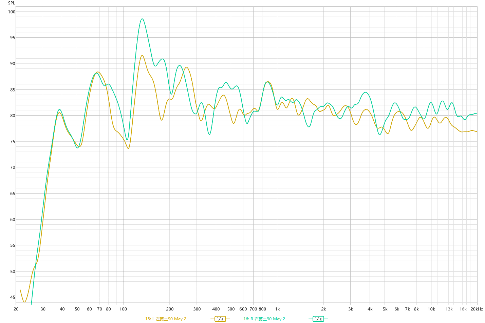
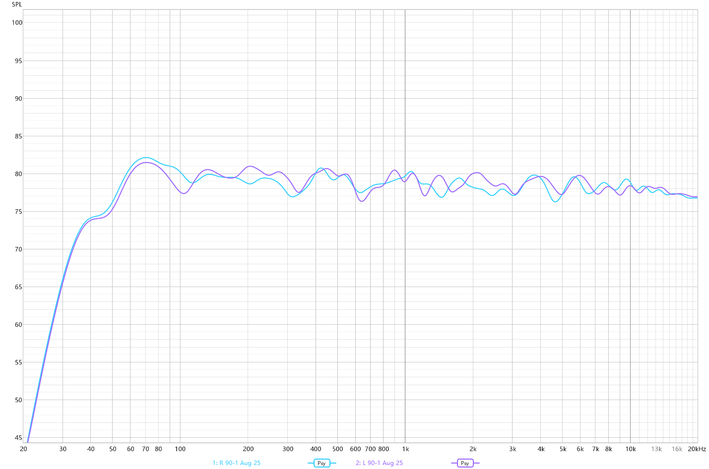

# Speaker Auto DSP（音箱 EQ 校准工具）

[](LICENSE)


[English](README.md)

一套把 [REW](https://www.roomeqwizard.com/) 频响测量数据转换成校正滤波器的脚本，
供 Windows 下的 [Equalizer APO](https://sourceforge.net/projects/equalizerapo/) 加载。
包含两条互相独立的管线：一条用于桌面／房间立体声音箱，一条用于车载音响。

| 校准前 | 校准后 |
| --- | --- |
|  |  |

## 原理背景

音箱的消声室响应并不是最终到达听者耳边的响应。大约 200–300 Hz 以下由房间模态主导：
驻波在某些频率叠加出几个 dB，在某些频率相互抵消，而且这个分布随位置改变。更高的频段
则由边界反射和音箱自身的指向性塑形——影响温和一些，但同样可测。车厢是这一切的极端情况：
容积小、界面硬、单元离轴且左右距离不等。

由此有三点决定了本工具的做法：

- **一次测量只描述空间中的一个点。** 在头部周围取多个话筒位置做平均，得到的响应才代表
  "聆听"而不是代表某一个点。平均在能量（功率）域进行，而不是直接对 dB 取平均——前者才
  对应声功率相加。
- **不是每个凹陷都该被填平。** 模态抵消只属于声场中的那一个位置：滤波器对整个空间生效，
  补偿会让没有零点的位置过冲、对零点本身几乎不起作用，同时还吃掉功放和单元的余量。
  反之，若一个凹陷在所有测量位置上都稳定出现，它更可能是音箱本身的性质，可以校正。
  本工具用各位置之间的离散度来区分二者，并据此限制提升量。
- **目标曲线不是一条直线。** 听感中性的房间内稳态响应带有轻微的低频抬升和高频缓降。房间管线
  采用 Harman 近场类目标：105 Hz 处 +3 dB 的 low shelf，1 kHz 以上每倍频程 −0.5 dB。

上面的 shelf 数值与高频斜率只是本次校准采用的版本，不是公开发表的标准曲线：其形态沿用了
聆听位偏好研究的一般结论，而具体数值是为本工具实际校准的桌面近场监听音箱定下的。如果你校准
的是别的音箱、别的场景——距离更远的书架箱、落地箱、家庭影院——请换成适合该场景的目标曲线。
曲线定义在唯一一处：`eq_common.py` 里的 `harman_nearfield_target`，`eq_make.py` 与
`verify_eq.py` 共用，替换只需改这里。`eq_make.py` 里的低频提升上限同样反映的是一只
3.5 英寸小单元的能力极限，不是一条通用规则。

校正以**最小相位**滤波器实现，因此群延迟很低，也不会引入预振铃。

## 环境要求

```
pip install numpy matplotlib
```

测量用 REW，回放端用 Equalizer APO。

## 房间 EQ

### 1. 测量

在 APO 处于 bypass 的状态下，用 REW 在聆听位周围的多个话筒位置分别扫频左右声道。
每条扫频导出为 `.txt` 放进 `原始数据/`，左声道文件名以 `L ` 开头，右声道以 `R ` 开头。

导出直接用 REW 默认的文本导出设置即可，无需加平滑。全分辨率默认导出与旧式
96 ppo 对数导出都被接受，同一批内可以混用；带 C 计权补偿的导出会触发警告——
直连麦克风时该设置会给数据烙入反 C 曲线。

### 2. 生成

```
python eq_make.py
```

输出位于 `output/`：

| 文件 | 用途 |
| --- | --- |
| `room_eq_48000Hz.wav`、`room_eq_44100Hz.wav` | 立体声最小相位 FIR 卷积核，推荐使用 |
| `left_eq.txt`、`right_eq.txt` | GraphicEQ 文本，供无法使用卷积的场景 |
| `15…19_*.png` | 校准前后预测响应、相对目标的残差、以及提升上限曲线 |

脚本生成后会把 `.wav` 读回，核对其幅频响应与设计的校正量是否一致；设计目标是最坏误差低于 0.1 dB。

### 3. 应用

在 Equalizer APO 的配置里加一行：

```
Convolution: E:\…\output\room_eq_48000Hz.wav
```

卷积核的采样率必须与播放设备的采样率一致，否则 APO 无法加载——这也是同时生成两个版本的原因。

输出不写 `Preamp:` 行。整体增益与余量交由使用者自行决定；脚本会打印本次施加的最大提升量，
方便据此选择衰减值。

### 4. 验证

挂上 EQ 后重新测量，按同样的命名规则导出到 `挂载eq后测出来的数据/`，然后运行：

```
python verify_eq.py
```

它会把实测的 EQ 后响应与预测值、目标曲线画在一起对比——这是确认滤波器是否真按设计工作的
唯一途径。

## 车载 EQ

车机施加的是一条左右共享的曲线，而非分声道校正，因此这条管线把所有测量一起平均。
把同一车型的扫频放进以车型命名的目录：

```
MyCar/
  L+R MyCar-1.txt
  L+R MyCar-2.txt
  ...
```

```
python car_eq.py --car MyCar                # → output/MyCar_shared_eq.txt
python car_eq.py --car MyCar --slug mycar   # 自定义输出文件名前缀
python car_eq.py --car MyCar --n 4          # 只使用前 4 个文件
python car_eq.py --car MyCar --bass-trim 0  # 关闭低频偏好修剪（默认 -5 dB @ 75 Hz）
```

这里的目标是 Audiofrog 官方车内曲线（随仓库附带 audiofrog_target_curve.csv，缺失时退回内置近似），输出写在固定的 127 个整数频点上，以兼容 wavelet 型车机。
目标曲线在官方形态上叠加了一层个人偏好修剪：低频 −5 dB 搁架（75 Hz 拐点）。官方 shelf 按「低频爱好者」口味调校（比 Harman 目标多 2 dB @ 20 Hz）、过渡带延伸到 ~316 Hz；修剪后 20 Hz 为 +4.7 dB（相对 1 kHz，约 Harman「少低频人群」的水平），低频仍整体高于中频、不挖坑，中高频维持官方形态（即 Harman 车载共识）。`--bass-trim` / `--bass-trim-fc` 可调。
车型目录建议加入 `.gitignore`。

## 许可证

[MIT](LICENSE) © 2026 BryleXia
